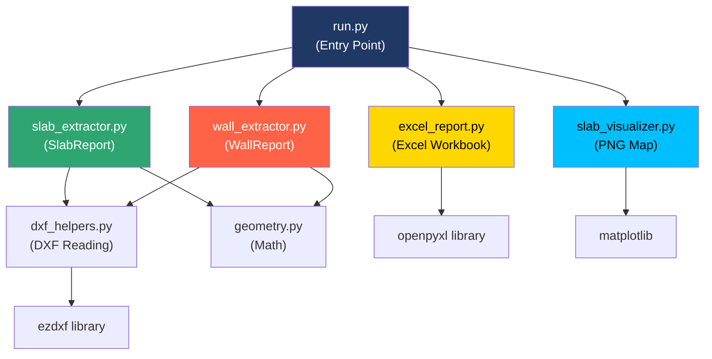
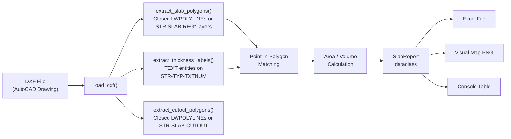

# Workspace Deep-Dive: DXF Quantity Take-Off Toolset

## Purpose

This workspace is a **structural engineering quantity take-off system** that reads DXF (AutoCAD) floor plan drawings and automatically extracts **slab** and **wall** quantities — areas, volumes, thicknesses, and lengths — outputting professional Excel reports with embedded visual maps.

It targets a specific structural drawing convention (layer naming like `STR-SLAB-REG150`, `STR-WALL-NS-200`, etc.) and is designed for a real production workflow where an engineer drops in a DXF and gets a Bill of Quantities.

---

## Workspace Structure

```
e:\experiments\
├── 01_slab_takeoff/          ← Core library: CLI-based slab + wall extraction
│   ├── run.py                ← Entry point (CLI)
│   ├── slab_extractor.py     ← Slab extraction logic + data models
│   ├── wall_extractor.py     ← Wall extraction logic + data models
│   ├── dxf_helpers.py        ← Low-level DXF entity reading
│   ├── geometry.py           ← Pure-math polygon operations
│   ├── slab_visualizer.py    ← Matplotlib slab map renderer
│   ├── wall_visualizer.py    ← Matplotlib wall map renderer
│   ├── excel_report.py       ← openpyxl Excel report writer
│   └── README.md
│
├── 02_wall_takeoff_analysis.py  ← Standalone exploratory script
│
└── 03_desktop_ui_takeoff/    ← GUI wrapper (customtkinter)
    ├── app.py                ← Full desktop application
    └── README.md
```

---

## Component 1: Core Library — `01_slab_takeoff/`

This is the heart of the system. It's a modular Python library with clean separation of concerns.

### Architecture Diagram



### Data Flow Pipeline



### Key Modules

#### [dxf_helpers.py](file:///e:/experiments/01_slab_takeoff/dxf_helpers.py) — DXF Reading Layer

| Function | Purpose |
|:---|:---|
| [load_dxf()](file:///e:/experiments/01_slab_takeoff/dxf_helpers.py#L15-L27) | Opens a DXF file and returns `(doc, modelspace)` |
| [extract_slab_polygons()](file:///e:/experiments/01_slab_takeoff/dxf_helpers.py#L30-L74) | Finds all closed LWPOLYLINEs on `STR-SLAB-REG*` layers, parses thickness from layer name suffix |
| [extract_thickness_labels()](file:///e:/experiments/01_slab_takeoff/dxf_helpers.py#L77-L113) | Finds TEXT entities containing "THK" on the `STR-TYP-TXTNUM` layer, extracts numeric thickness via regex |
| [extract_cutout_polygons()](file:///e:/experiments/01_slab_takeoff/dxf_helpers.py#L116-L140) | Finds cutout regions on `STR-SLAB-CUTOUT` layer |

> [!NOTE]
> The helpers extract data into **plain Python dicts** — no ezdxf objects leak out, which keeps the rest of the codebase decoupled from the DXF library.

#### [geometry.py](file:///e:/experiments/01_slab_takeoff/geometry.py) — Pure Math

| Function | Algorithm | Purpose |
|:---|:---|:---|
| [polygon_area_sqmm()](file:///e:/experiments/01_slab_takeoff/geometry.py#L7-L25) | Shoelace formula | Polygon area in mm² |
| [sqmm_to_sqm()](file:///e:/experiments/01_slab_takeoff/geometry.py#L28-L30) | Division by 1,000,000 | Unit conversion |
| [polygon_centroid()](file:///e:/experiments/01_slab_takeoff/geometry.py#L33-L48) | Arithmetic mean of vertices | Centroid for label placement |
| [point_in_polygon()](file:///e:/experiments/01_slab_takeoff/geometry.py#L51-L73) | Ray-casting algorithm | Tests if a text label falls inside a slab polygon |
| [polygon_bbox()](file:///e:/experiments/01_slab_takeoff/geometry.py#L76-L85) | Min/max coordinates | Bounding box |

#### [slab_extractor.py](file:///e:/experiments/01_slab_takeoff/slab_extractor.py) — Core Slab Logic

The main function [extract_slabs()](file:///e:/experiments/01_slab_takeoff/slab_extractor.py#L56-L213) orchestrates the full pipeline:

1. **Load** the DXF via `load_dxf()`
2. **Extract** slab polygons (closed polylines on `STR-SLAB-REG*` layers)
3. **Extract** thickness labels (TEXT entities with "THK")
4. **Match** each slab polygon to its thickness label using **point-in-polygon** test
5. **Fallback** to layer name parsing if no text label found inside the polygon
6. **Cross-check** — warns if text label thickness ≠ layer name thickness
7. **Compute** area (m²) and volume (m³ = area × thickness)
8. **Build** summary grouped by thickness

Data models (all `@dataclass`):
- [SlabEntry](file:///e:/experiments/01_slab_takeoff/slab_extractor.py#L15-L28) — one slab with all computed quantities
- [SlabSummaryRow](file:///e:/experiments/01_slab_takeoff/slab_extractor.py#L31-L36) — aggregated totals per thickness
- [SlabReport](file:///e:/experiments/01_slab_takeoff/slab_extractor.py#L39-L53) — complete report with metadata

#### [wall_extractor.py](file:///e:/experiments/01_slab_takeoff/wall_extractor.py) — Wall Logic

Similar structure to slab extraction. [extract_walls()](file:///e:/experiments/01_slab_takeoff/wall_extractor.py#L49-L151) processes:

| Wall Type | Layers | Classification |
|:---|:---|:---|
| Structural | `STR-WALL-REG` | Shear/load-bearing walls |
| Non-Structural 100mm | `STR-WALL-NS-100` | Partition walls |
| Non-Structural 150mm | `STR-WALL-NS-150` | Partition walls |
| Non-Structural 200mm | `STR-WALL-NS-200` | Partition walls |

Wall length is estimated as `perimeter / 2` (assumes thin rectangular shapes — a reasonable heuristic for walls drawn as closed polylines).

Data models: [WallEntry](file:///e:/experiments/01_slab_takeoff/wall_extractor.py#L9-L19), [WallSummaryRow](file:///e:/experiments/01_slab_takeoff/wall_extractor.py#L22-L26), [WallReport](file:///e:/experiments/01_slab_takeoff/wall_extractor.py#L28-L37)

#### [excel_report.py](file:///e:/experiments/01_slab_takeoff/excel_report.py) — Professional Excel Output

Generates a **multi-sheet Excel workbook** using openpyxl:

| Sheet | Content |
|:---|:---|
| **Slab Details** | Every slab: name, layer, thickness, source, area, volume, centroid |
| **Summary** | Totals grouped by thickness |
| **Slab Map** | Embedded PNG visualization |
| **Structural Walls** | Structural wall quantities + interactive height input (yellow cell B3) |
| **Non-Structural Walls** | Partition wall quantities + interactive height input |

> [!IMPORTANT]
> The wall sheets have a clever feature: Volume is calculated via an **Excel formula** (`=E{row}*B$3`) that references an editable "Floor-to-Floor Height" cell (B3, highlighted yellow). Users can change this value and all volumes update automatically.

Styling: Professional blue headers (`#1F3864`), alternating row fills, bold totals row, warning section for data quality issues.

#### [slab_visualizer.py](file:///e:/experiments/01_slab_takeoff/slab_visualizer.py) & [wall_visualizer.py](file:///e:/experiments/01_slab_takeoff/wall_visualizer.py) — Visual Maps

Both render matplotlib PNGs with:
- Dark background (`#1a1a2e`)
- Color-coded polygons by thickness
- Labeled centroids with slab/wall names
- Adaptive font sizing based on area
- Legend with color key

Slab color palette:
| Thickness | Color |
|:---|:---|
| 125mm | `#00BFFF` (Cyan) |
| 150mm | `#32CD32` (Lime) |
| 175mm | `#FFD700` (Gold) |
| 200mm | `#FF6347` (Tomato) |

#### [run.py](file:///e:/experiments/01_slab_takeoff/run.py) — CLI Entry Point

Usage: `python run.py "C:\path\to\file.dxf"`

Orchestrates: extract → console print → visual map → Excel report. Outputs are saved next to the source DXF file.

---

## Component 2: Exploratory Script — `02_wall_takeoff_analysis.py`

[02_wall_takeoff_analysis.py](file:///e:/experiments/02_wall_takeoff_analysis.py) is a standalone **exploration/debugging script** that:
- Opens a hardcoded DXF file (`Sample-1.dxf`)
- Queries entities on the 4 wall layers
- Prints entity type counts (HATCH, LWPOLYLINE, etc.)
- Examines HATCH boundary counts and LWPOLYLINE closed/open status

This was likely written during early R&D to understand the DXF structure before building the wall extractor.

---

## Component 3: Desktop GUI — `03_desktop_ui_takeoff/`

[app.py](file:///e:/experiments/03_desktop_ui_takeoff/app.py) wraps the core library in a **customtkinter** desktop application.

### UI Layout

```
┌─────────────────────────┬───────────────────────┐
│  Slab Quantity Take-Off │                       │
│  (title + subtitle)     │                       │
│                         │   Map Preview Panel   │
│  [Select DXF File] [__] │   (DXF preview or     │
│                         │    result map)         │
│  Height (m): [3.0]      │                       │
│                         │                       │
│  [Run Take-Off]         │                       │
│                         │                       │
│  ┌─── Log Output ────┐  │                       │
│  │ Welcome!...        │  │                       │
│  │ Extracting...      │  │                       │
│  │ ✅ SUCCESS!        │  │                       │
│  └────────────────────┘  │                       │
└─────────────────────────┴───────────────────────┘
```

### Key Features

- **File Picker**: Standard file dialog filtered to `.dxf`
- **DXF Preview**: On file selection, renders a full DXF preview using `ezdxf.addons.drawing` (runs in background thread)
- **Height Input**: User-configurable floor-to-floor height for wall volume calculation
- **Threaded Processing**: All heavy work runs in `threading.Thread(daemon=True)` to keep UI responsive
- **Result Display**: After processing, shows the structural wall map in the preview panel
- **Post-processing**: After generating the Excel, reopens it with openpyxl to inject the user's height value into cell B3

### Import Strategy
The GUI imports modules from `01_slab_takeoff/` by dynamically inserting its parent directory into `sys.path` at [line 10-12](file:///e:/experiments/03_desktop_ui_takeoff/app.py#L10-L12).

---

## DXF Layer Convention (Critical Domain Knowledge)

The entire system depends on a specific **structural drawing layer naming convention**:

| Element | Layer Pattern | Entity Type | Thickness Source |
|:---|:---|:---|:---|
| Slab boundaries | `STR-SLAB-REG{thickness}` | Closed LWPOLYLINE | Layer suffix + TEXT label |
| Slab labels | `STR-TYP-TXTNUM` | TEXT | `"{N} THK"` pattern |
| Slab cutouts | `STR-SLAB-CUTOUT` | Closed LWPOLYLINE | — |
| Structural walls | `STR-WALL-REG` | Closed LWPOLYLINE | Unknown (0) |
| Non-structural walls | `STR-WALL-NS-{100\|150\|200}` | Closed LWPOLYLINE | Layer suffix |

> [!WARNING]
> Drawing units are assumed to be **millimeters** throughout. All area conversions divide by 1,000,000 to convert mm² → m².

---

## Dependencies

| Package | Version | Purpose |
|:---|:---|:---|
| `ezdxf` | Any recent | DXF file parsing |
| `openpyxl` | Any recent | Excel file generation |
| `matplotlib` | Any recent | PNG visualization (Agg backend) |
| `customtkinter` | Any recent | Desktop UI (Component 3 only) |
| `Pillow` | Any recent | Image display in GUI (Component 3 only) |

---

## Observations & Potential Improvements

> [!NOTE]
> These are observations from the code review, not issues with functionality.

1. **Cutout subtraction not implemented**: `extract_cutout_polygons()` exists in [dxf_helpers.py](file:///e:/experiments/01_slab_takeoff/dxf_helpers.py#L116-L140) but is never called by `slab_extractor.py`. Slab areas don't subtract openings/voids.

2. **Centroid calculation is approximate**: [polygon_centroid()](file:///e:/experiments/01_slab_takeoff/geometry.py#L33-L48) uses arithmetic mean of vertices (not the true area-weighted centroid). For irregular polygons, labels may appear outside the shape.

3. **Wall thickness for STR-WALL-REG**: Structural wall thickness is set to `0` because the layer name doesn't encode thickness. The system would need text-label matching (similar to slabs) to resolve this.

4. **Wall length heuristic**: `perimeter / 2` is a rough estimate that works for rectangular walls but breaks for L-shaped or T-shaped wall polygons.

5. **No `02_` numbering gap**: There's no `02_` directory — the standalone script suggests this was an intermediate experiment that didn't graduate to a full module.

6. **Hardcoded DXF path** in [02_wall_takeoff_analysis.py](file:///e:/experiments/02_wall_takeoff_analysis.py#L3) — this is a personal debug script, not production code.
